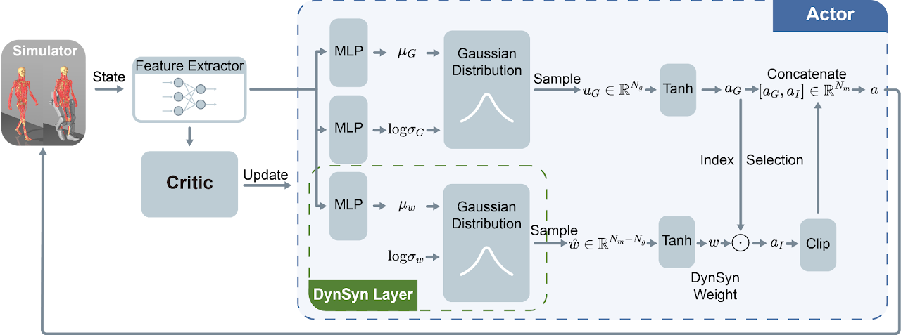

# DynSyn
<p align="center"><strong style="font-size: 18px;">
DynSyn: Dynamical Synergistic Representation for Efficient Learning and Control in Overactuated Embodied Systems
</strong>
</p>

<p align="center">
 🏠 <a href="https://sites.google.com/view/dynsyn">Homepage</a> | 📖 <a href="https://arxiv.org/abs/2407.11472">Paper</a>
|     📑 <a href="https://sites.google.com/view/dynsyn/poster">Poster</a>
</p>

Learning an effective policy to control high-dimensional, overactuated systems is a significant challenge for deep reinforcement learning algorithms. The coordination of actuators, known as muscle synergies in neuromechanics, is considered a presumptive mechanism that simplifies the generation of motor commands. DynSyn aims to generate synergistic representations of dynamical structures and perform task-specific, state-dependent adaptation to the representations to improve motor control.



## Demo
<div align="center">
    
</div>


## Quick Start

### 0. Installation
```
git clone https://github.com/Beanpow/DynSyn.git
cd DynSyn

conda create -n "dynsyn" python=3.9
conda activate dynsyn
pip install poetry
poetry install
```

### 1. Generate DynSyn
```
MUJOCO_GL=egl gen_dynsyn -f configs/DynSynGen/dynsyn.yaml -e myoLegWalk
```

### 2. Training

DynSyn
```
MUJOCO_GL=egl runner -f configs/DynSyn/myowalk.json
```

E2E
```
MUJOCO_GL=egl runner -f configs/E2E/myowalk.json
```


### 3. Evaluation
`dynsyn_weight_amp` is determined by $kt+a$ if dynsyn_weight_amp is not set in the config file. So in the evaluation, we can set the `dynsyn_weight_amp` to align with the training setting.

If `dynsyn_weight_amp` is set in the training process, then there is no need to set it in the evaluation process.

```
"load_kwargs": {
    "dynsyn_weight_amp": 0.1
}
```


## Troubleshooting
1. If you encounter the error `render_mode expected 'rgb_array' but received 'None'` when training the MyoSuite environment

    The myosuite use gym==0.13.0 which will be wrapped by the shimmy - `GymV21CompatibilityV0`. The shimmy will set the render_mode to `None` which will cause the error. To fix this, change the following code

    **a. stable_baselines3/common/vec_env/patch_gym.py:60**

    from
    ```
    return shimmy.GymV21CompatibilityV0(env=env)
    ```
    to
    ```
    return shimmy.GymV21CompatibilityV0(env=env, render_mode=getattr(env, "render_mode", None))
    ```
    **b. shimmy/openai_gym_compatibility.py:259**

    from
    ```
    obs, reward, done, info = self.gym_env.step(action)

    if self.render_mode is not None:
        self.render()

    return convert_to_terminated_truncated_step_api((obs, reward, done, info))
    ```
    to
    ```
    obs, reward, done, info = self.gym_env.step(action)

    **delete the render function call**

    return convert_to_terminated_truncated_step_api((obs, reward, done, info))
    ```

## Citation
If you find this open source release useful, please reference in your paper:
```
@article{he2024dynsyn,
  title={DynSyn: Dynamical Synergistic Representation for Efficient Learning and Control in Overactuated Embodied Systems},
  author={He, Kaibo and Zuo, Chenhui and Ma, Chengtian and Sui, Yanan},
  journal={arXiv preprint arXiv:2407.11472},
  year={2024}
}
```
